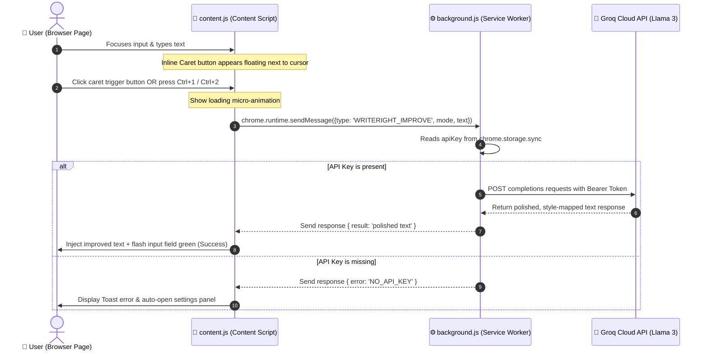

# <p align="center">✨ WriteRight AI ✨</p>

<p align="center">
  
  
  
  
</p>

<p align="center">
  <b>Elevate your writing in real-time. Instantly switch between friendly human prose and high-powered executive communication on any webpage.</b>
</p>

---

## 📖 Table of Contents
1. [Overview](#-overview)
2. [Dual AI Writing Modes](#-dual-ai-writing-modes)
3. [Visual Walkthrough & Interaction Flow](#-visual-walkthrough--interaction-flow)
4. [Tech Stack & Architecture](#-tech-stack--architecture)
5. [Premium Glassmorphic Design System](#-premium-glassmorphic-design-system)
6. [Step-by-Step Installation Guide](#-step-by-step-installation-guide)
7. [Keyboard Shortcuts](#-keyboard-shortcuts)
8. [Project File Anatomy](#-project-file-anatomy)
9. [Privacy & Credentials Isolation](#-privacy--credentials-isolation)

---

## 🌟 Overview

WriteRight AI is a premium browser extension that injects a writing assistant directly beside your cursor in **every text field, textarea, and contenteditable frame** on the web. Powered by the hyper-fast **Groq Cloud API** and Meta's **Llama-3.3-70b-versatile** model, it delivers near-instant style changes, grammar correction, and tone polishing.

---

## 🎭 Dual AI Writing Modes

WriteRight AI provides two curated modes tailored for different communication scenarios:

### 👤 Normal Human Mode
> *"Keeps conversations authentic, natural, and warm."*
* **Ideal for**: Slack messages, informal emails, WhatsApp Web, community forums.
* **Instruction Set**: Corrects grammar, spelling, and punctuation while maintaining a friendly, casual, and highly natural conversational tone.

### 💼 CEO Mode
> *"Speaks with conviction, brevity, and authority."*
* **Ideal for**: Executive briefs, client communications, project summaries, team updates.
* **Instruction Set**: Rewrites text to sound confident, direct, and executive. Removes fillers, hedges, and weak phrasing, returning only pure authoritative prose.

---

## 🔄 Visual Walkthrough & Interaction Flow

Here is how WriteRight AI facilitates messaging passing between components under Manifest V3:



---

## 🛠️ Tech Stack & Architecture

WriteRight AI uses pure client-side standard technologies without complex build steps:

* **Frontend Layout**: HTML5, Vanilla ES6 JavaScript, and modular CSS variables.
* **Extension Standard**: Manifest V3, utilizing background service workers rather than persistent script pages to reduce memory footprint.
* **Data Layer**: `chrome.storage.sync` to synchronize API keys across devices under the user's active Chrome profile.
* **Caret Tracking Node**: The Content Script computes layout rectangles dynamically via the Selection API (`getRangeAt`), mapping trigger buttons directly to text insertion coordinates.

---

## 🎨 Premium Glassmorphic Design System

The extension popup and overlay dashboard feature a futuristic, premium dark mode aesthetic:
* **Glassmorphism**: Translucent panels built with `background: rgba(255, 255, 255, 0.03)` and fine borders `border: 1px solid rgba(255, 255, 255, 0.07)`.
* **Atmospheric Gradients**: Radial glows in deep purples and violet accent shades:
  ```css
  background: linear-gradient(145deg, #0f0b1a 0%, #1a1230 50%, #120e20 100%);
  ```
* **Status Indication**: Smooth transition states showing red highlights for missing API keys, turning to vivid green halos once configured.

---

## 📦 Step-by-Step Installation Guide

To load the extension into your browser manually, follow this process:

### 1️⃣ Clone or Download this Project
Clone the repository to your local directory:
```bash
git clone https://github.com/your-username/writeright-ai.git
cd writeright-ai
```

### 2️⃣ Obtain a Groq API Key
1. Visit the [Groq Cloud Console](https://console.groq.com/keys).
2. Register a developer account (completely free tier available).
3. Generate a new API key (it will begin with `gsk_`).
4. Copy the key to your clipboard.

### 3️⃣ Load the Unpacked Extension in Chrome
1. Open Google Chrome and enter `chrome://extensions/` in the URL bar.
2. In the top-right corner, toggle the **Developer mode** switch to **ON**.
3. In the top-left corner, click the **Load unpacked** button.
4. Select the `writeright-ai` folder (the directory containing [manifest.json](file:///c:/Projects/type%20me%20-%20github/manifest.json)).

> [!TIP]
> Pin WriteRight AI in your browser bar by clicking the Extensions puzzle icon (🧩) and selecting the pin icon next to **WriteRight AI**.

### 4️⃣ Activate your API Key
1. Click the WriteRight AI icon (✨) in your Chrome toolbar.
2. The popup will load showing a `⚠️ API Key Missing` warning.
3. Paste your Groq API Key into the password field.
4. Click **Save Key**. The card will animate and show `✅ API Key Active`. You are ready to write!

---

## ⌨️ Keyboard Shortcuts

| Shortcut | Description | Context |
| :--- | :--- | :--- |
| <kbd>Ctrl</kbd> + <kbd>1</kbd> | Triggers **👤 Normal Human** mode | Focus inside any input field |
| <kbd>Ctrl</kbd> + <kbd>2</kbd> | Triggers **💼 CEO Mode** | Focus inside any input field |
| *Caret Click* | Opens the hovering select panel | Displays once typing starts |

---

## 📂 Project File Anatomy

```text
writeright-ai/
├── manifest.json      # Extension configs, host permission, and service worker registration
├── background.js      # Service Worker: Handles storage retrieval & CORS-compliant API fetching
├── content.js         # Injector: Detects input caret, positions UI, replaces content
├── style.css          # Injected UI styles: Namespaced (.wr-*) styling for overlays and toasts
├── popup.html         # Settings UI dashboard (Glassmorphic input panel)
├── popup.js           # Settings script: Saves and hides/shows your API keys
├── .gitignore         # Prevents pushing local variables (.env) or systems metadata to Git
├── .env.example       # Template reference for environment variables
├── README.md          # Visual documentation and instructions guide
└── icons/             # Chrome Extension logo assets
    ├── icon16.png
    ├── icon48.png
    └── icon128.png
```

---

## 🔒 Privacy & Credentials Isolation

* **Direct API Dispatches**: WriteRight AI makes direct HTTPS calls to the Groq Cloud endpoint. There are no intermediate third-party servers tracking or logging your keystrokes.
* **Isolated Credentials**: Your API key is stored locally in Chrome's internal secure storage sandbox. It is never exposed in the source code or pushed to any repository.
* **Style Isolation**: All injected DOM components and CSS rules are scoped under custom `.wr-` classes to prevent visual conflicts or breaks on target sites.

---

## 📝 License
This project is licensed under the [MIT License](LICENSE) - see the file for details.
